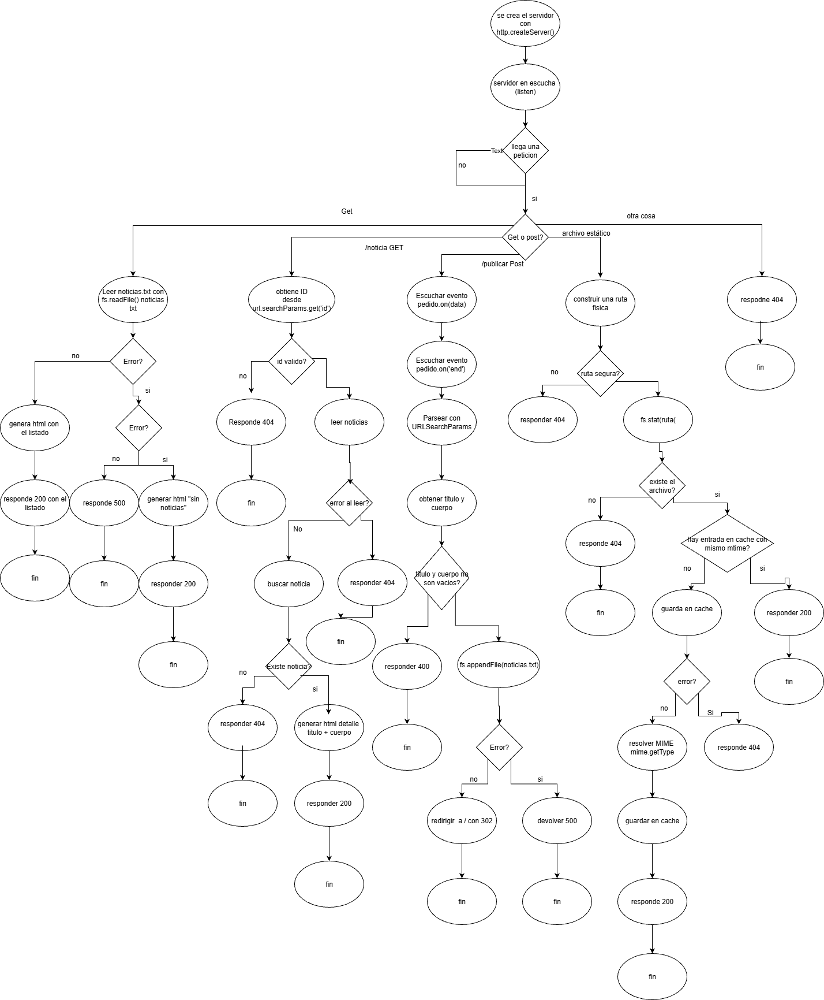

# AO1 PPROG WEB 2
## Facundo Castillo
# punto 1 - diagrama de flujo

# Punto 2 - Arquitectura y selección de librerías

Para este trabajo hice todo con Node.js nativo, sin Express, porque la idea era entender bien cómo funciona el servidor por dentro. De esa forma controlo el flujo de cada request: qué ruta entra, qué método usa, cuándo leer archivos, cuándo guardar, y qué código HTTP devolver.

## 2.a - Módulos nativos que utilicé

### `http`
Es el módulo principal para levantar el servidor web.

Lo uso con:
- `createServer()` para crear el servidor.
- `listen()` para dejarlo escuchando en el puerto.
- `writeHead()` y `end()` para responder al cliente con headers y cuerpo.
- 
write() permite enviar el cuerpo en partes. En este proyecto uso end() directamente porque envía y cierra en un paso, pero write() sería útil para respuestas grandes.

Los elegí porque es la base de todo en este TP y me permite resolver el routing manualmente, sin frameworks.

### `fs/promises`
Lo uso para todo lo que es archivos, siempre de forma asíncronica.

Métodos que uso en el proyecto:
- `readFile()` para leer noticias y archivos estáticos.
- `appendFile()` para guardar nuevas noticias.
- `stat()` para verificar si existe un archivo y para obtener `mtime` (sirve para saber si cambió y refrescar caché).
Cada noticia se guarda como una línea JSON dentro de noticias.txt usando appendFile(). Esto permite almacenar tanto el título como el cuerpo de forma estructurada. Al leer el archivo con readFile() se separa por saltos de línea y se parsea cada línea

Sobre `readdir()`: en esta implementación no fue necesario usarlo porque las rutas estáticas se resuelven directamente desde el pathname pedido por el cliente. De todas formas, `readdir()` sería útil si quisiera listar automáticamente los archivos de una carpeta y generar una vista dinámica de directorio.

Lo elegí porque el TP pide persistencia en archivo de texto y además necesito servir archivos de `public`.

### `url` (clase `URL`)
Me sirve para parsear la URL de cada petición de forma prolija.

Uso:
- `new URL(...)`
- `pathname` para saber la ruta
- `searchParams.get('id')` para obtener el parámetro GET en `/noticia?id=N`

Lo elegí para evitar parseos manuales con strings, que son más propensos a errores.

### `path`
Lo uso para construir rutas físicas del sistema de archivos con `path.join(...)`.

Por ejemplo:
- ruta de `noticias.txt`
- ruta base de la carpeta `public`

Me sirve para que las rutas funcionen bien en distintos sistemas operativos y evitar errores con separadores de carpeta.

## 2.b - Paquete de npm usado

### `mime`
- Instalación: `npm install mime`
- Versión usada: `4.1.0`

En el código uso `mime.getType(path)` para resolver el tipo de contenido según la extensión del archivo.

el método principal usado: `getType(path: string): string | null`

Elegí getType como método principal porque es el punto exacto donde transformo una ruta de archivo en un Content-Type válido para responder al navegador correctamente.

Esto es importante porque así el navegador interpreta correctamente lo que recibe. Si no mando bien el `Content-Type`, el navegador puede mostrar mal o no aplicar el recurso.

## Cierre

En resumen, intenté mantener una arquitectura simple y clara:
- casi todo con módulos nativos de Node,
- solo una dependencia externa (`mime`),
- manejo explícito de rutas, errores y códigos HTTP,
- y caché en memoria para estáticos, con validación por `mtime` para no servir versiones viejas.

# Punto 3 - Explicación de la implementación

En este punto explico cómo resolvi junto a la IA cada bloque funcional del servidor. La idea fue mantener una estructura simple, con funciones separadas por responsabilidad, y aprovechar el modelo asincrónico de Node para no bloquear el servidor mientras se leen o escriben archivos.

## Bloque A - Servidor HTTP y routing

Primero creo el servidor con `http.createServer(...)`. En cada request construyo un objeto `URL` a partir de `pedido.url` para obtener fácilmente `pathname` y parámetros.

Con eso hago el enrutamiento por método y ruta:
- `GET /` -> listado de noticias.
- `GET /noticia` -> detalle por parámetro `id`.
- `POST /publicar` -> guardar noticia nueva.
- otros `GET` -> intento servir archivo estático desde `public`.
- lo que no encaja -> `404`.

La ventaja de este enfoque es que se ve claramente qué hace el servidor en cada caso y qué estado HTTP devuelve.

## Bloque B - Archivos estáticos con caché

Para estáticos uso la función `servirEstatico(pathname, respuesta)`. Ahí:
1. Construyo la ruta física con `path.join(...)`.
2. Verifico que la ruta quede dentro de `public` (evita pedir archivos fuera de esa carpeta).
3. Uso `fs.stat()` para confirmar que el recurso existe y es archivo.
4. Reviso caché en memoria (`cache[rutaAbsoluta]`).

La caché guarda:
- el contenido del archivo,
- el `contentType`,
- y `mtimeMs` (última fecha de modificación).

Si el archivo no cambió (`mtime` igual), respondo desde memoria (**cache hit**).  
Si cambió, vuelvo a leer disco, actualizo caché y respondo (**cache miss**).  
El `Content-Type` lo determino con `mime.getType(...)`.

## Bloque C - Captura de datos POST

En `POST /publicar` no recibo el body de una sola vez. Node lo entrega en partes (**chunks**), por eso:
- en `pedido.on('data', chunk)` voy concatenando en una variable `cuerpo`,
- en `pedido.on('end')` sé que llegaron todos los datos y recién ahí los proceso.

Después parseo con `new URLSearchParams(cuerpo)` y extraigo `titulo` y `cuerpo`.  
Si alguno viene vacío, respondo `400`. Si está todo bien, guardo la noticia.
Con new URLSearchParams(cuerpo) parseo el string recibido. Por ejemplo si llega titulo=Hola&cuerpo=Mundo, datos.get('titulo') devuelve 'Hola'

## Bloque D - Parámetros GET

En la ruta de detalle (`GET /noticia?id=N`) uso:
- `url.searchParams.get('id')` para obtener el parámetro.

Luego valido que sea un entero no negativo. Si no cumple, devuelvo `404`.  
Si es válido, leo noticias y busco por índice:
- si existe -> muestro detalle con `200`,
- si no existe -> `404`.

## Bloque E - Persistencia en archivo de texto

Para guardar noticias uso `fs.appendFile(...)` y para leerlas uso `fs.readFile(...)`.

Cada noticia nueva se guarda como una línea JSON con título y cuerpo.  
Al listar o mostrar detalle, leo el archivo completo, separo por líneas y parseo cada entrada.

También dejé compatibilidad con líneas antiguas (texto simple), para que noticias cargadas antes del cambio no se pierdan.

## Modelo asincrónico de Node en esta implementación

El servidor combina `async/await` con eventos:
- `async/await` para operaciones con archivos (`readFile`, `appendFile`, `stat`);
- eventos (`data`, `end`) para recepción de body en POST.

Esto permite atender múltiples requests sin bloquear la ejecución mientras hay operaciones de I/O.

## Manejo de estados HTTP usados

- `200`: respuesta correcta (listado, detalle, estáticos).
- `302`: redirección al finalizar una publicación correcta.
- `400`: validación fallida en formulario (faltan título/cuerpo).
- `404`: ruta, recurso o noticia no encontrada.
- `500`: error interno inesperado.

## reposiotrio

https://github.com/Facunditome/AO1-WEB2

## enlace editable del diagrama de flujo

https://drive.google.com/file/d/1NH8SQw3Qqq48_FzLo7f8Qo8IWfESyLNP/view?usp=sharing

o 

https://app.diagrams.net/#G1NH8SQw3Qqq48_FzLo7f8Qo8IWfESyLNP

